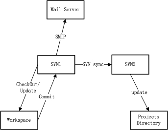

# SVN-Manager   
在工作中经常需要与SVN打交道，每次配置SVN版本库都很烦，考虑使用脚本来减少工作量。由于Shell是系统自带的，就用它了。

脚本希望具备的功能如下：

>1.Subversion安装

>2.新建版本库

>3.SVN主备同步

>4.强制写log

>5.目录自动更新

>6.邮件通知

>7.其他功能（待定）

SVN的备份通过SVN sync进行，是系统自带的，并且能够实时进行同步，避免常规备份，数据无法实时备份的问题。为确保同步完成，邮件通知和自动更新将分别在两台SVN服务器上进行，能够收到邮件则证明数据已经完成提交操作，目录能够自动更新则证明数据完成了同步。

